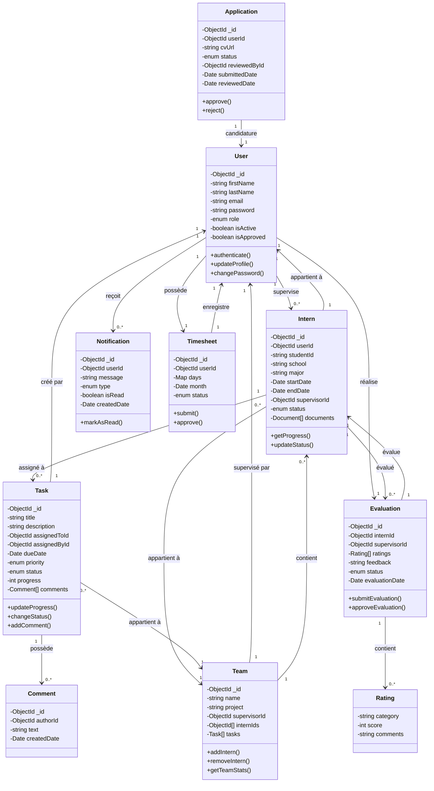
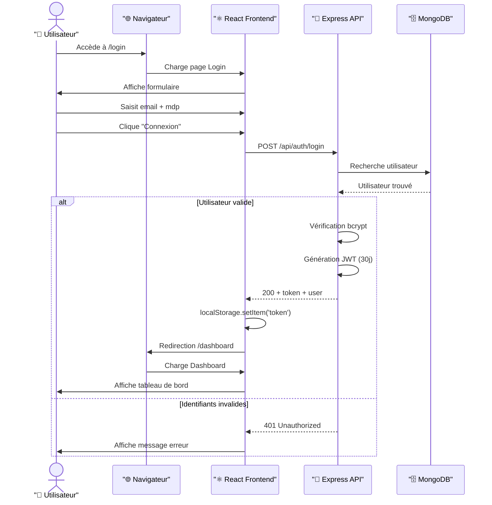
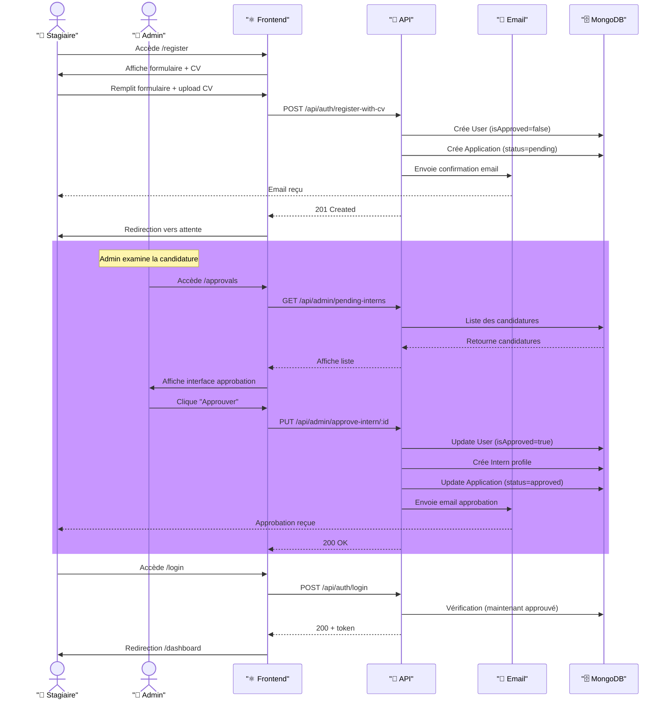
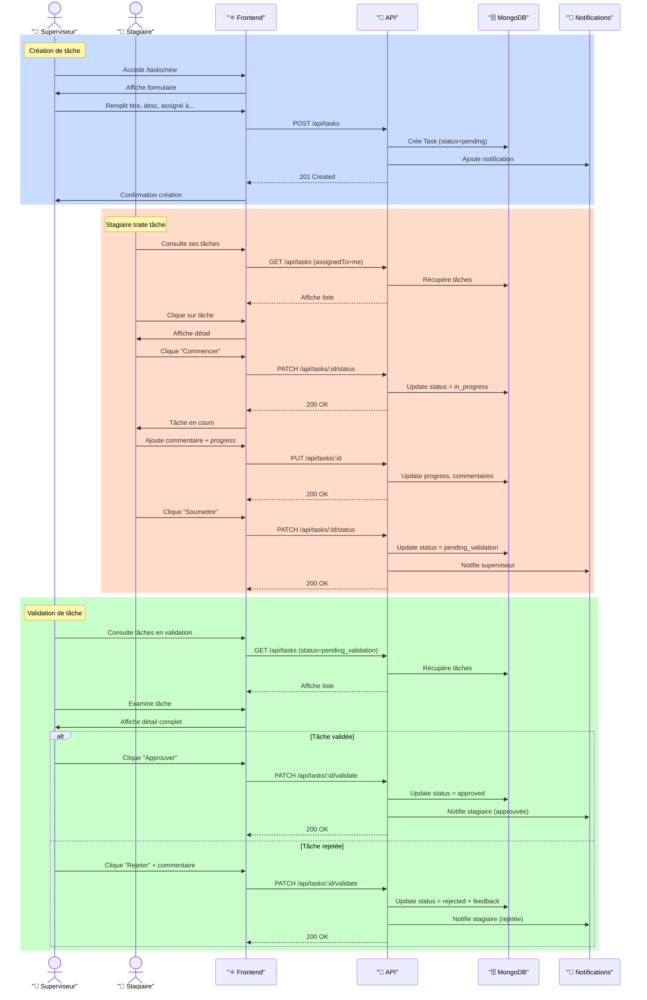
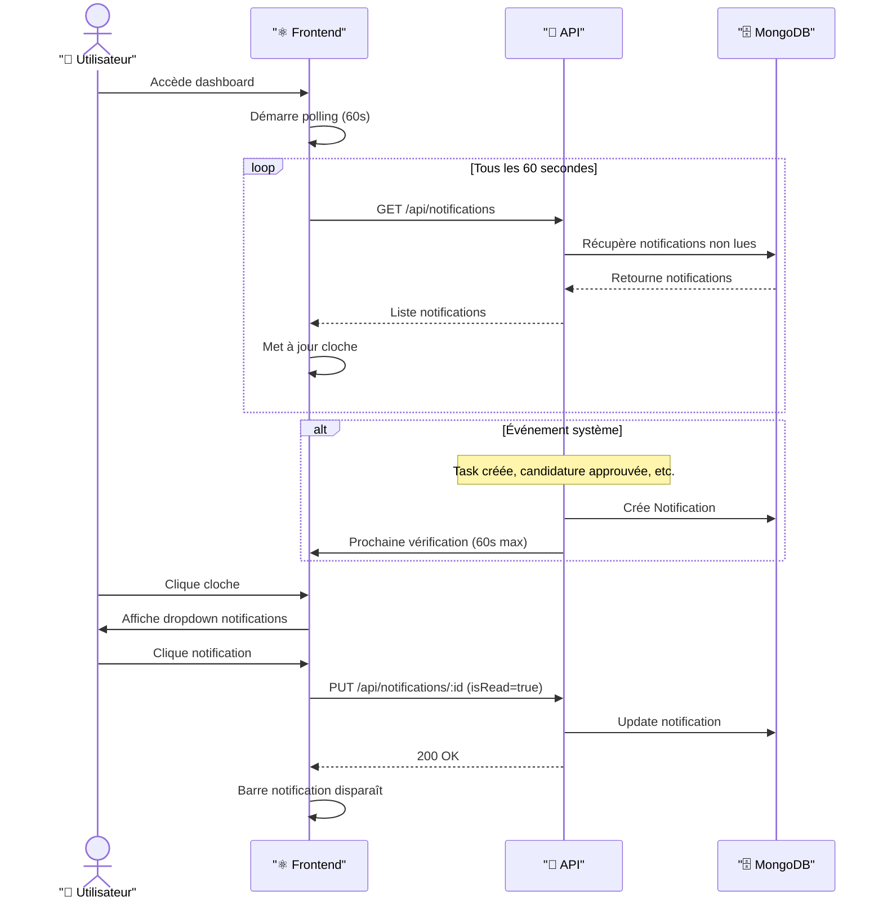
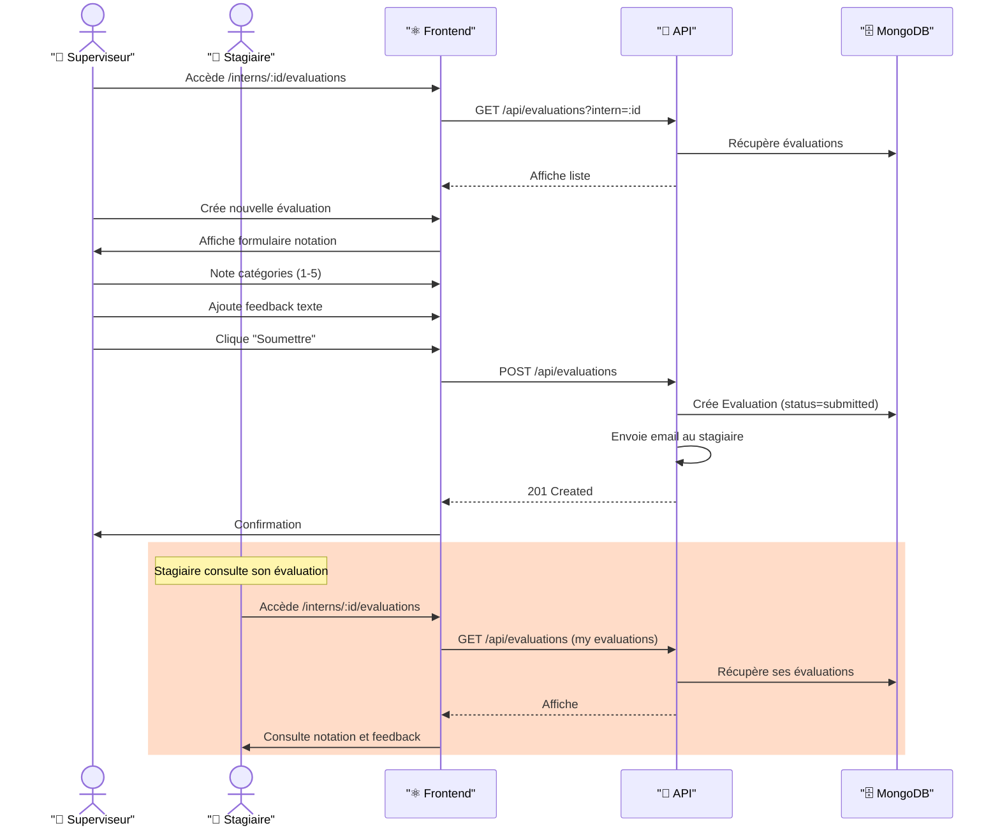
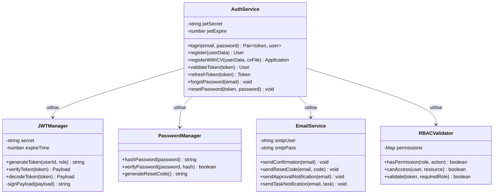

# Diagrammes UML — Plateforme GESTION

## 1. Diagramme de Cas d'Utilisation

```mermaid
usecase diagram
    actor Admin as "👤 Administrateur"
    actor Supervisor as "👤 Superviseur"
    actor Intern as "👤 Stagiaire"
    actor System as "🔐 Système"

    rectangle GESTION {
        usecase UC1 as "S'authentifier"
        usecase UC2 as "Gérer Stagiaires"
        usecase UC3 as "Créer Tâches"
        usecase UC4 as "Gérer Équipes"
        usecase UC5 as "Évaluer Stagiaires"
        usecase UC6 as "Approuver Candidatures"
        usecase UC7 as "Gérer Utilisateurs"
        usecase UC8 as "Consulter Rapports"
        usecase UC9 as "Consulter Tâches"
        usecase UC10 as "Gérer Documents"
        usecase UC11 as "Valider Tâches"
        usecase UC12 as "Réinitialiser Mot de Passe"
        usecase UC13 as "Envoyer Notifications"
        usecase UC14 as "Consulter Tableau de Bord"
    }

    %% Authentification
    Admin --> UC1
    Supervisor --> UC1
    Intern --> UC1

    %% Admin
    Admin --> UC6
    Admin --> UC7
    Admin --> UC8
    Admin --> UC2

    %% Superviseur
    Supervisor --> UC2
    Supervisor --> UC3
    Supervisor --> UC4
    Supervisor --> UC5
    Supervisor --> UC11
    Supervisor --> UC8

    %% Stagiaire
    Intern --> UC9
    Intern --> UC10

    %% Tous
    Admin --> UC14
    Supervisor --> UC14
    Intern --> UC14

    %% Système
    System --> UC12
    System --> UC13

    %% Include relationships
    UC1 ..|> UC14 : <<include>>
    UC6 ..|> UC2 : <<include>>
    UC5 ..|> UC2 : <<include>>
    UC11 ..|> UC3 : <<include>>
```

---

## 2. Diagramme de Classes



---

## 3. Diagramme de Séquence — Flux de Connexion



---

## 4. Diagramme de Séquence — Workflow Candidature



---

## 5. Diagramme de Séquence — Création et Validation de Tâche



---

## 6. Diagramme de Séquence — Système de Notifications



---

## 7. Diagramme de Séquence — Flux d'Évaluation



---

## 8. Diagramme de Classe — Détail Authentification



---

## Légende

| Symbole | Signification |
|---------|---------------|
| 👤 | Acteur (utilisateur) |
| ⚛️ | Frontend React |
| 🔌 | API Express |
| 🗄️ | Base de données MongoDB |
| 📧 | Service d'email |
| 🔔 | Système de notifications |
| ✅ | Succès |
| ❌ | Erreur |
| `<<include>>` | Relation d'inclusion |
| `<<extend>>` | Relation d'extension |

---

**Fin des diagrammes UML — Plateforme GESTION**
